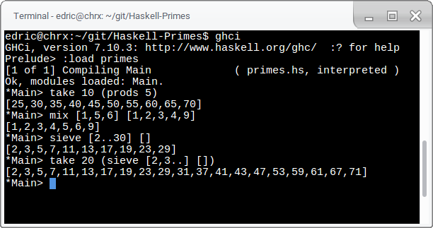

**A05 - Programming Paradigm: Functional**

Student Info
=============

Your name: Edric Yu

Operating system: GalliumOS

Lab computer or your own computer: my own

Did you receive help from your instructor? A few clarifications

Functions
=========

`prods`, `mix`, `sieve`
------------------------

`firstn`
------------------------

`primesto`
------------------------

`mergesort`, `quicksort`
------------------------

`infix2rpn`, `evalrpn`
------------------------

Assignment Reflection
======================

Hours to complete assignment: 2

Hours to complete extra credit: 2.5

Haskell was fun, I think I have a decent grasp on it now!
